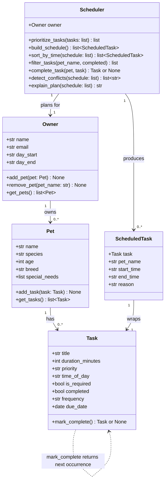

# PawPal+ — Final Class Diagram (Mermaid.js)

Paste the block below into https://mermaid.live to render the diagram,
then export as uml_final.png.

## Changes from initial UML

| What changed | Why |
|---|---|
| `Task` gained `completed`, `frequency`, `due_date` | Needed for mark-complete, recurring logic, and filtering |
| `Task.mark_complete()` now returns `Optional[Task]` | Recurring tasks need to produce a successor; one-off tasks return `None` |
| `ScheduledTask` gained `pet_name` | Multi-pet schedules need to show which pet each task belongs to |
| `Scheduler` gained `sort_by_time`, `filter_tasks`, `complete_task`, `detect_conflicts` | Phase 4 algorithmic layer |
| `Scheduler._make_reason()` added (private) | Extracted from `build_schedule` to keep that method readable |
